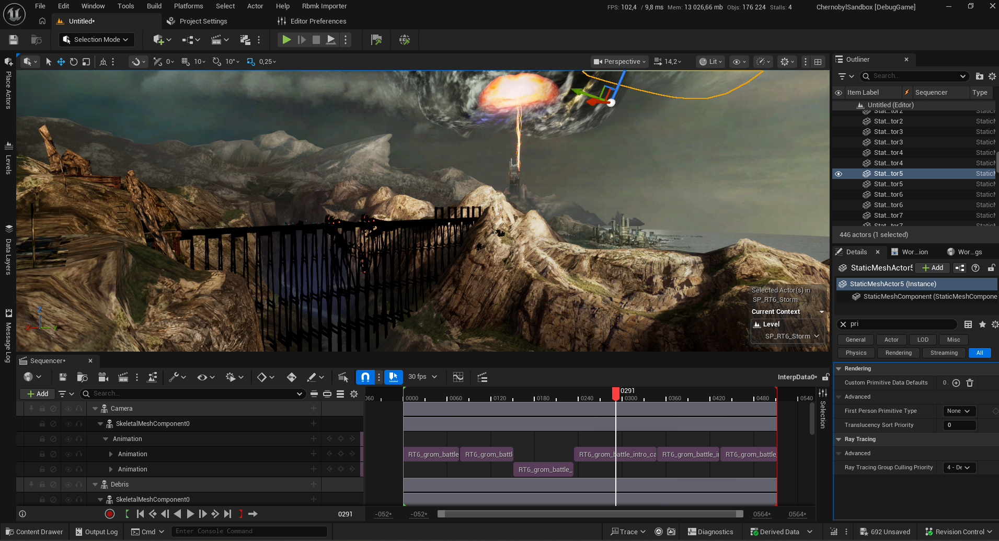
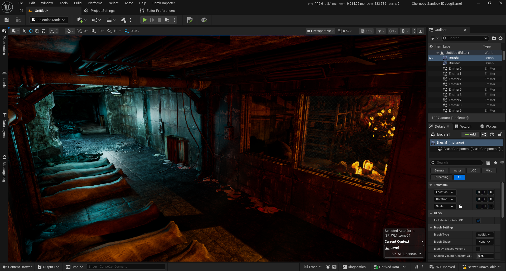
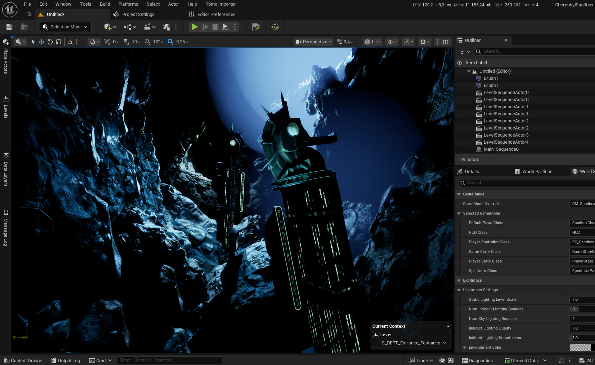

# RedUEPackageImporter

`RedUEPackageImporter` это экспериментальный плагин для Unreal Engine 5, предназначенный для переноса старых игр на Unreal Engine (UE1-UE3) в современный UE5.

Основная задача проекта: импортировать legacy-пакеты, восстанавливать базовые ассеты, переносить данные уровней и воссоздавать игровую логику, включая legacy `Kismet`.

## Скриншоты

## Возможности

- Импорт базовых ассетов:
  - текстур
  - статических и скелетных моделей
  - материалов
  - анимаций
  - звуков
- Импорт legacy-объектов и данных уровней
- Перенос legacy `Kismet`-логики в UE5
- Импорт через специальные editor-функции в `Blueprint`
- Поддержка game-specific модулей для отдельных игр

## Текущий статус

Проект находится в экспериментальной стадии.

На данный момент экспериментально поддерживаются:

- `Singularity`
- `BioShock Infinite` (`Bioshock3`)

Степень поддержки зависит от конкретной игры, типа ассета и используемой скриптовой логики. Некоторые классы, объекты или `Kismet`-действия после импорта могут требовать ручной доработки.

## Как устроен проект

Плагин разделен на несколько модулей:

- `RedUELegacyImporter` и `RedUELegacyRuntime` содержат общую основу для импорта и runtime-логики
- `RedUESingularity` и `RedUESingularityImporter` содержат поддержку `Singularity`
- `RedUEBioshock3` и `RedUEBioshock3Importer` содержат поддержку `BioShock Infinite`

Импорт выполняется через специальные функции, доступные в `Blueprint` и предназначенные для запуска прямо из редактора Unreal Engine.

## Общий сценарий импорта

1. Подготовить legacy-пакеты и исходные данные игры.
2. Открыть UE5-проект с включенным плагином.
3. Запустить нужные editor-функции импорта через `Blueprint`.
4. Импортировать базовый контент: текстуры, модели, материалы, анимации и звуки.
5. Импортировать данные уровней, legacy-акторы и скриптовую `Kismet`-логику.
6. Проверить результат и при необходимости вручную исправить неподдерживаемые или частично поддерживаемые случаи.

## Что переносит плагин

`RedUEPackageImporter` ориентирован на восстановление значительной части структуры старой игры внутри UE5:

- пакетов и их содержимого
- ссылок между ассетами
- размещения акторов на уровне
- legacy-данных объектов
- sequence/Kismet-логики
- game-specific legacy-классов

Отдельный акцент сделан на поддержке `Kismet`: в проекте есть набор legacy `SequenceAction`, `SequenceEvent` и runtime-хелперов для переноса старой скриптовой логики в UE5.

## Ограничения

- Проект пока не готов для production-использования
- Поддерживается ограниченный набор игр
- Реализованы не все legacy-классы, форматы и `Kismet`-действия
- После импорта часть контента может требовать ручной правки, перелинковки или замены на нативные системы UE5

## Структура исходников

- `Source/RedUELegacyImporter` - общий код импорта
- `Source/RedUELegacyRuntime` - runtime-системы для импортированного контента
- `Source/RedUESingularity` - runtime-поддержка `Singularity`
- `Source/RedUESingularityImporter` - импорт для `Singularity`
- `Source/RedUEBioshock3` - runtime-поддержка `BioShock Infinite`
- `Source/RedUEBioshock3Importer` - импорт для `BioShock Infinite`
